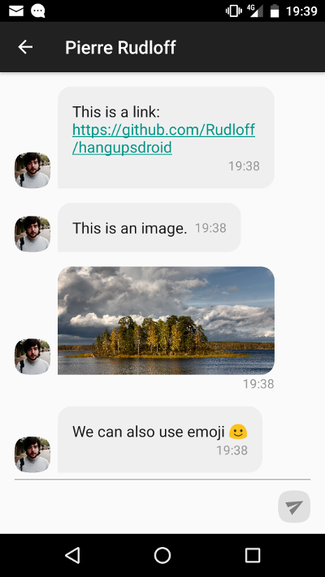

# HangupsDroid

HangupsDroid is a port of [hangups](https://hangups.readthedocs.io/en/latest/) to Android.

It allows you to use Hangouts on an Android phone without Play Services.

## Warning

Never give your Google account credentials to any application or device that you don’t trust. Logging into Google grants hangups unrestricted access to your account. hangups works this way because Google does not provide any other method to access the Hangouts API.
